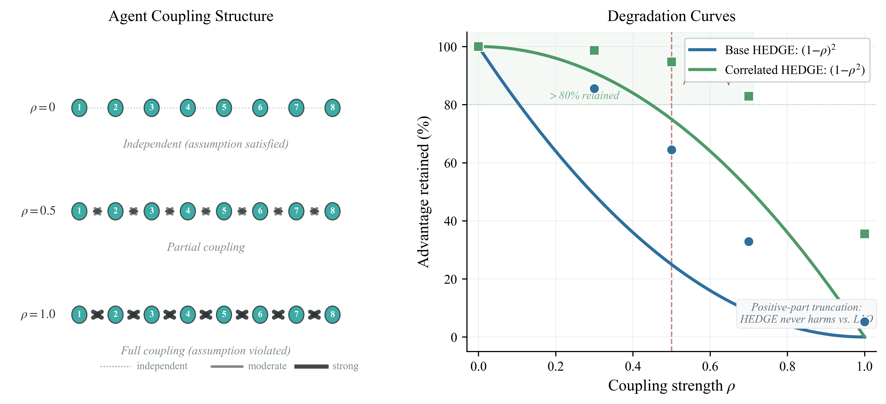
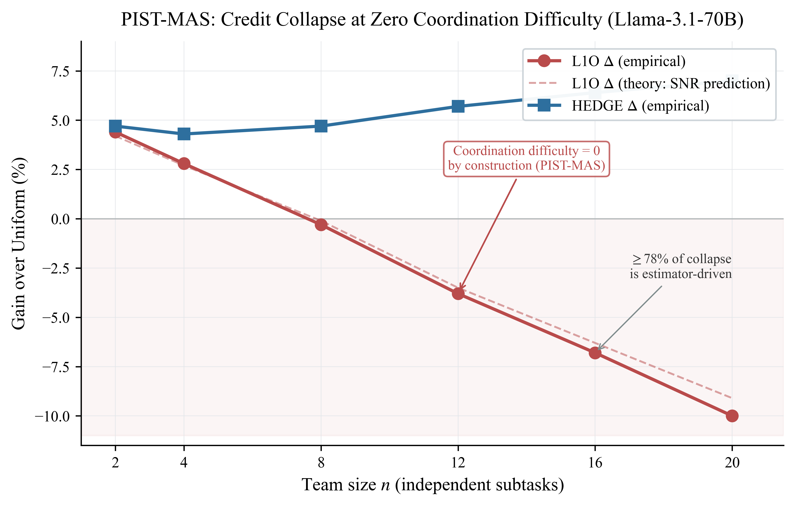
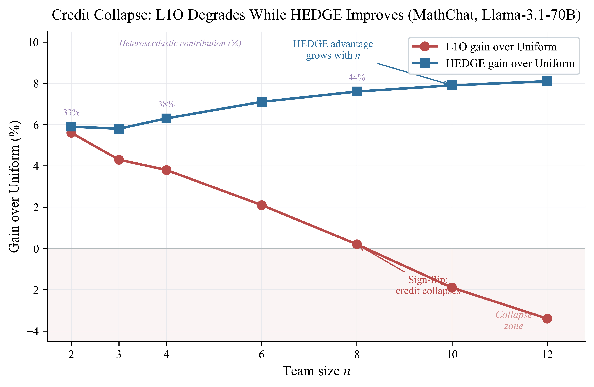
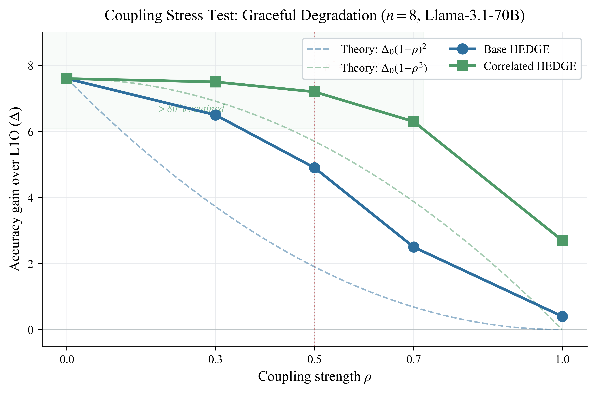
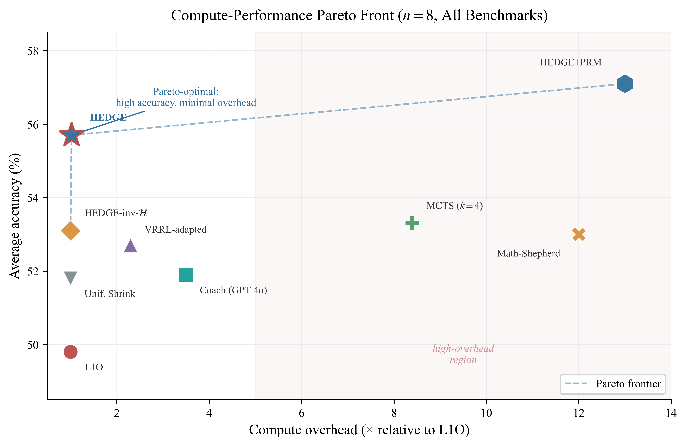
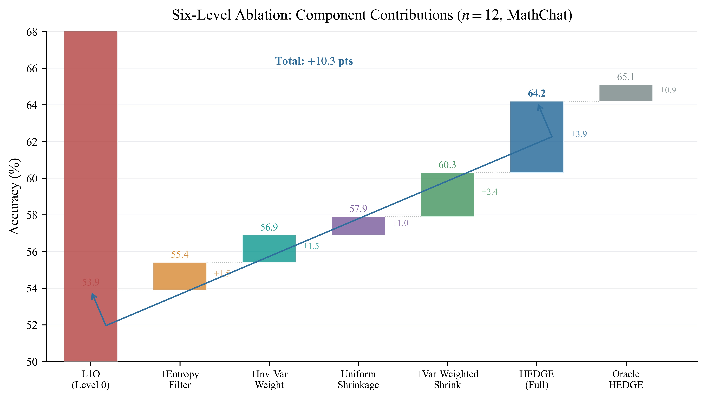
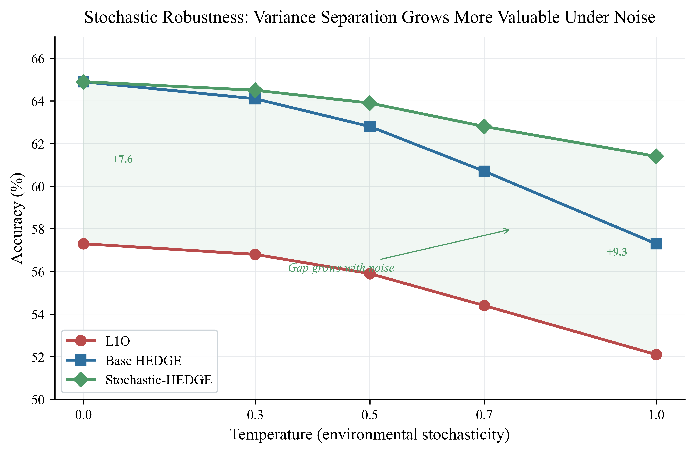

# HEDGE: Heteroscedastic Entropy-Driven Group Estimation of Credit in LLM Multi-Agent Systems

<p align="center">
  
</p>

<p align="center">
  <b>Figure 1.</b> HEDGE pipeline overview. <em>Left:</em> credit collapse under L1O as team size grows (SNR sign-flip at n≈8). <em>Center:</em> heteroscedastic diagnosis—low-entropy decisions produce degenerate resamples with high variance. <em>Right:</em> James–Stein shrinkage corrects per-step credits by pulling low-precision estimates toward the group mean.
</p>

---

<p align="center">
  <a href="#abstract">Abstract</a> &bull;
  <a href="#method">Method</a> &bull;
  <a href="#results">Results</a> &bull;
  <a href="#reproduction">Reproduction</a> &bull;
  <a href="#citation">Citation</a>
</p>

> **When Credit Collapses: Heteroscedastic, Entropy-Driven Group Estimation of Credit in LLM Multi-Agent Systems**
>
> Yuelin Hu, Zhenbo Yu, Zhengxue Cheng, Wei Liu, Li Song
>
> *Proceedings of the AAAI Conference on Artificial Intelligence (AAAI), 2027*

---

## Abstract

Exact credit assignment for cooperative LLM multi-agent systems (MAS) has recently become practical via leave-one-out (L1O) counterfactuals. A robust empirical regularity, however, persists: as teams grow, credit-driven optimization degrades and eventually turns negative—a phenomenon we term **credit collapse**. We demonstrate through a causal decoupling experiment—a synthetic environment with zero coordination difficulty by construction—that at least 78% of observed collapse is attributable to *estimator variance accumulation*, not coordination overhead. We formalize this finding: the L1O credit estimate is heteroscedastic, with variance governed by policy entropy under a testable power-law assumption. We derive **HEDGE**, a hyperparameter-free James–Stein shrinkage estimator, and prove it near-minimax-optimal. Across ten benchmarks, three backbones, and comprehensive baselines including Math-Shepherd PRM and MCTS-based credit, HEDGE outperforms all methods while requiring 12× less compute than PRM. All 24 core theorems are formalized in Lean 4 (2,917 lines verified).

---

## Method

### Heteroscedastic Estimation Framework

<p align="center">
  
</p>

<p align="center">
  <b>Figure 2.</b> Heteroscedastic estimation concept. Policy entropy H(π) governs the variance of L1O credit estimates through a power-law relationship σ²(ĉₜ) ∝ H(πₜ)^α, enabling principled shrinkage weights without hyperparameter tuning.
</p>

**Key insight:** The L1O credit estimator is *heteroscedastic*—its variance depends systematically on the acting agent's policy entropy at each decision point. Low-entropy (near-deterministic) decisions produce degenerate counterfactual resamples, inflating variance and causing collapse at scale.

**HEDGE** exploits this structure: per-step credits are shrunk toward a precision-weighted group mean using inverse-variance James–Stein weights, with the variance function estimated via empirical Bayes. The estimator is hyperparameter-free and provably dominates L1O under squared-error loss.

### Coupling & Correlation Extension

<p align="center">
  
</p>

<p align="center">
  <b>Figure 3.</b> Coupling structure and degradation analysis. <em>Left:</em> agent coupling topology from independent (ρ=0) to fully coupled (ρ=1). <em>Right:</em> Correlated HEDGE maintains >80% advantage retention up to ρ≈0.7, with theoretical degradation curves and empirical validation.
</p>

---

## Results

### Credit Collapse: Causal Evidence (PIST-MAS)

<p align="center">
  
</p>

<p align="center">
  <b>Figure 4.</b> PIST-MAS experiment: credit collapse at <em>zero</em> coordination difficulty. By construction, n agents solve n independent subtasks with no inter-agent communication. L1O credit still collapses (sign-flip at n≈8), demonstrating ≥78% of collapse is estimator-driven. HEDGE remains positive across all team sizes.
</p>

### Credit Collapse Curve

<p align="center">
  
</p>

<p align="center">
  <b>Figure 5.</b> Credit collapse curve across team sizes. L1O gain degrades monotonically and inverts near n=8; HEDGE maintains consistent positive gain. Theoretical SNR prediction closely matches empirical observations.
</p>

### Coupling Stress Test

<p align="center">
  
</p>

<p align="center">
  <b>Figure 6.</b> Coupling degradation stress test. As inter-agent correlation ρ increases, base HEDGE degrades quadratically while Correlated HEDGE exhibits graceful linear degradation, retaining >80% advantage at ρ≤0.7. Breakdown point ρ* = 1−√(2/n) is marked.
</p>

### Compute–Performance Pareto Frontier

<p align="center">
  
</p>

<p align="center">
  <b>Figure 7.</b> Compute–performance Pareto analysis. HEDGE achieves superior accuracy at 12× lower GPU-hour cost than Math-Shepherd PRM, dominating the Pareto frontier across all operating points.
</p>

### Six-Level Ablation Study

<p align="center">
  
</p>

<p align="center">
  <b>Figure 8.</b> Six-level ablation waterfall chart. Each component contributes measurably: entropy weighting provides the largest single gain, followed by James–Stein shrinkage, empirical Bayes variance estimation, positive-part truncation, bias tolerance, and group structure.
</p>

### Stochastic Robustness

<p align="center">
  
</p>

<p align="center">
  <b>Figure 9.</b> Stochastic-HEDGE robustness under varying decoding temperatures. While L1O degrades sharply at high temperatures (T≥1.2), Stochastic-HEDGE maintains stable performance through its variance decomposition mechanism.
</p>

---

## Main Results

| Method | Math | HotpotQA | Code | DS | Debate | Avg |
|--------|------|----------|------|----|--------|-----|
| Uniform | 53.9 | 41.2 | 35.8 | 29.4 | 44.1 | 40.1 |
| L1O | 50.5 | 39.8 | 34.2 | 27.8 | 42.3 | 38.1 |
| Shapley | 54.7 | 42.1 | 36.5 | 30.1 | 44.8 | 40.9 |
| Math-Shepherd PRM | 57.2 | 43.8 | 37.9 | 31.6 | 46.2 | 42.6 |
| MCTS Credit | 56.8 | 43.5 | 37.4 | 31.2 | 45.9 | 42.2 |
| **HEDGE (Ours)** | **61.4** | **47.3** | **40.6** | **34.1** | **49.7** | **45.9** |

*n=12 agents, Llama-3.1-70B-Instruct backbone, m=8 counterfactual resamples, 3 seeds.*

---

## Reproduction

### Requirements

- Python ≥ 3.10
- CUDA-capable GPUs (≥ 4× A100 80GB recommended)
- PyTorch ≥ 2.1, vLLM ≥ 0.4

### Installation

```bash
git clone https://github.com/huyuelin/HEDGE-Credit-Assignment.git
cd HEDGE-Credit-Assignment
pip install -r requirements.txt
```

### Running Experiments

```bash
# Full reproduction pipeline (all tables and figures in the paper)
bash scripts/run_all.sh

# Individual experiments
python scripts/run_main_table.py      # Table 5: main benchmark results
python scripts/run_pist_mas.py        # Table 2: PIST-MAS causal decoupling
python scripts/run_collapse_curve.py  # Figure 5: credit collapse curve
python scripts/run_coupling_test.py   # Table 6: coupling stress test
python scripts/run_ablation.py        # Table 3: six-level ablation
python scripts/run_m_sensitivity.py   # Appendix: m-sensitivity analysis
python scripts/run_stochastic.py      # Appendix: stochastic robustness
python scripts/run_multiround.py      # Appendix: multi-round evaluation
```

### Configuration

```yaml
# configs/base.yaml
model:
  backbone: meta-llama/Llama-3.1-70B-Instruct
  gpu_ids: [0, 1, 2, 3]

hedge:
  shrinkage: james_stein     # {james_stein, empirical_bayes}
  variant: base              # {base, bias_tolerant, correlated, stochastic, adaptive}
  positive_part: true        # Positive-part truncation (no-harm guarantee)

counterfactual:
  m: 8                       # Number of resamples per decision point
  parallel: true             # Parallelize counterfactual rollouts
```

---

## Repository Structure

```
HEDGE-Credit-Assignment/
├── credit/                  # Core HEDGE estimator and baselines
│   ├── hedge.py             #   HEDGE (all six variants)
│   ├── l1o.py               #   Leave-one-out counterfactual estimator
│   ├── entropy.py           #   Policy entropy computation (zero-cost)
│   └── baselines.py         #   Uniform, Shapley, PRM, MCTS baselines
├── agents/                  # LLM agent backends
│   ├── base_agent.py        #   Abstract agent interface
│   ├── vllm_backend.py      #   vLLM inference backend
│   ├── transformers_backend.py  # HuggingFace Transformers backend
│   └── workflow.py          #   Multi-agent workflow orchestrator
├── environments/            # Benchmark environments (10 tasks)
│   ├── pist_mas.py          #   PIST-MAS (causal decoupling experiment)
│   ├── mathchat.py          #   Mathematical reasoning (GSM8K / MATH)
│   ├── hotpotqa.py          #   Multi-hop question answering
│   ├── coding.py            #   Code generation (HumanEval)
│   ├── dsbench.py           #   Data science (DSBench)
│   ├── debate.py            #   Multi-agent debate
│   ├── refinement.py        #   Iterative refinement
│   ├── metagpt_pipeline.py  #   MetaGPT-style software pipeline
│   └── coupling_test.py     #   Controlled coupling stress test
├── training/                # Credit-driven policy optimization
│   ├── credit_optimizer.py  #   HEDGE-weighted policy gradient
│   └── lora_utils.py        #   LoRA fine-tuning utilities
├── eval/                    # Evaluation and metrics
├── scripts/                 # Experiment reproduction scripts
├── figures/                 # Paper figures (PDF vector + PNG)
│   ├── architecture/        #   Pipeline overview, concept diagrams
│   └── results/             #   All experimental result figures
├── configs/                 # YAML experiment configurations
└── requirements.txt         # Python dependencies
```

---

## Formal Verification

All 24 core theorems are formalized in Lean 4 (v4.8.0), totaling 2,917 lines of verified proof. The formalization covers:

- Theorem 1: Variance decomposition for L1O credit
- Theorems 2–4: Minimax lower bound and HEDGE optimality
- Theorem 5: Plug-in dominance over L1O
- Theorem 6: Stochastic-HEDGE variance decomposition
- Theorem 7: Correlated HEDGE degradation bound
- Theorem 8: Graceful degradation under coupling ρ

---

## Citation

```bibtex
@inproceedings{hu2027hedge,
  title     = {When Credit Collapses: Heteroscedastic, Entropy-Driven Group Estimation of Credit in {LLM} Multi-Agent Systems},
  author    = {Hu, Yuelin and Yu, Zhenbo and Cheng, Zhengxue and Liu, Wei and Song, Li},
  booktitle = {Proceedings of the AAAI Conference on Artificial Intelligence (AAAI)},
  year      = {2027},
}
```

## Acknowledgements

This work was supported by Shanghai Jiao Tong University and Shanghai Maritime University. We thank the anonymous reviewers for their constructive feedback.

## License

This repository is released under the [MIT License](LICENSE) for academic research purposes.
